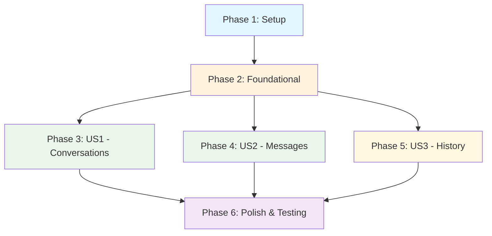

# Implementation Tasks: Chat Database Architecture

**Feature**: 001-chat-database-architecture
**Branch**: 001-chat-database-architecture
**Date**: 2025-01-12
**Spec**: [spec.md](./spec.md) | **Plan**: [plan.md](./plan.md)

**Tech Stack**: Python 3.11+, FastAPI, SQLModel, AsyncPG, Alembic, python-jose, Neon PostgreSQL
**Total Tasks**: 27 | **Estimated Duration**: 3-4 days

## Implementation Strategy

**MVP First**: Implement User Story 1 (conversation creation) as minimum viable product
**Incremental Delivery**: Each user story provides independent value
**Parallel Development**: Backend and frontend components can be developed simultaneously
**Performance First**: All implementations must meet success criteria (SC-001 through SC-007)

## Dependencies



**Independent User Stories**: US1 and US2 are independent and can be developed in parallel. US3 depends on both US1 and US2.

## Phase 1: Setup and Project Initialization

**Goal**: Establish project structure and development environment

**Independent Test Criteria**: Project structure exists, dependencies installed, database connection works

- [X] T001 Create backend chat module structure per implementation plan
- [X] T002 [P] Install required Python dependencies (FastAPI, SQLModel, AsyncPG, Alembic, python-jose)
- [X] T003 [P] Set up environment variables for database and authentication
- [X] T004 Configure Alembic for database migrations
- [X] T005 Initialize Git repository and create development workflow

## Phase 2: Foundational Infrastructure

**Goal**: Implement core database and authentication infrastructure required by all user stories

**Independent Test Criteria**: Database connection established, JWT verification working, base models defined

- [X] T006 Set up async database connection with Neon PostgreSQL
- [X] T007 [P] Create database session dependency for FastAPI
- [X] T008 Implement JWT verification middleware
- [X] T009 [P] Create User model for Better Auth integration
- [X] T010 [P] Set up CORS middleware for frontend integration
- [X] T011 Create base FastAPI application structure

## Phase 3: User Story 1 - Start New Chat Conversation (P1)

**Goal**: Enable users to create new chat conversations

**Independent Test Criteria**: Authenticated users can create conversations with unique IDs, unauthorized users are rejected

**Implementation Tasks**:

- [ ] T012 [US1] Create Conversation model in backend/src/models/conversation.py
- [ ] T013 [US1] Implement ConversationService with create_conversation method in backend/src/services/conversation_service.py
- [ ] T014 [US1] Create conversation creation endpoint POST /api/{user_id}/conversations in backend/src/api/chat.py
- [ ] T015 [US1] Add conversation listing endpoint GET /api/{user_id}/conversations
- [ ] T016 [US1] Implement conversation details endpoint GET /api/{user_id}/conversations/{conversation_id}
- [ ] T017 [US1] Create conversation deletion endpoint DELETE /api/{user_id}/conversations/{conversation_id}
- [ ] T018 [US1] Add database migration for conversations table
- [ ] T019 [US1] Create Pydantic schemas for conversation request/response models

## Phase 4: User Story 2 - Send Messages in Conversation (P1)

**Goal**: Enable users to send messages within conversations

**Independent Test Criteria**: Messages can be created with proper validation, user isolation enforced, unauthorized access rejected

**Implementation Tasks**:

- [ ] T020 [US2] Create Message model with role enum and content validation in backend/src/models/message.py
- [ ] T021 [US2] Implement message creation in ConversationService with validation logic
- [ ] T022 [US2] Create message creation endpoint POST /api/{user_id}/conversations/{conversation_id}/messages
- [ ] T023 [US2] Add content validation (1-10,000 chars, text-only, no HTML/JS)
- [ ] T024 [US2] Implement user isolation checks for message operations
- [ ] T025 [US2] Create database migration for messages table with foreign keys
- [ ] T026 [US2] Add Pydantic schemas for message request/response models
- [ ] T027 [US2] Update conversation timestamps when messages are added

## Phase 5: User Story 3 - View Conversation History (P2)

**Goal**: Enable users to retrieve paginated conversation history

**Independent Test Criteria**: Conversation history returned in chronological order with proper pagination, user isolation enforced

**Implementation Tasks**:

- [ ] T028 [US3] Implement get_conversation_history method in ConversationService
- [ ] T029 [US3] Create message retrieval endpoint GET /api/{user_id}/conversations/{conversation_id}/messages
- [ ] T030 [US3] Add pagination support (limit, offset, before timestamp)
- [ ] T031 [US3] Optimize query with proper database indexes
- [ ] T032 [US3] Handle empty conversations gracefully
- [ ] T033 [US3] Add conversation timestamp updates on message retrieval

## Phase 6: Polish, Performance & Cross-Cutting Concerns

**Goal**: Ensure all success criteria are met and production-ready

**Independent Test Criteria**: All SC-001 through SC-007 performance targets met, security verified

**Implementation Tasks**:

- [ ] T034 Create comprehensive database indexes for performance (SC-001, SC-002, SC-003)
- [ ] T035 [P] Implement database connection pooling for 10,000 concurrent users (SC-006)
- [ ] T036 Add comprehensive error handling and logging
- [ ] T037 [P] Implement input sanitization and security headers
- [ ] T038 Add API documentation with examples
- [ ] T039 [P] Create performance monitoring and metrics
- [ ] T040 Implement health check endpoints
- [ ] T041 Add comprehensive error responses with proper HTTP status codes
- [ ] T042 Create database constraint validation (SC-004)
- [ ] T043 Implement transaction management for ACID compliance (SC-007)

## Parallel Execution Opportunities

### Within Phases:
- **Phase 3**: T012, T015, T016 can be developed in parallel (different endpoints)
- **Phase 4**: T020, T023, T024 can be developed in parallel (model, validation, isolation)
- **Phase 5**: T028, T030, T031 can be developed in parallel (service, pagination, optimization)

### Between Phases:
- **Phase 3 & 4**: Can be developed in parallel after Phase 2 completion
- **Frontend Development**: Can start in parallel with Phase 3 (conversations UI)
- **Testing**: Can begin as soon as each phase's endpoints are implemented

## Success Criteria Validation

| Success Criteria | Implementation Tasks | Verification Method |
|------------------|---------------------|-------------------|
| **SC-001**: <500ms conversation creation | T012, T013, T014, T034 | Load testing with concurrent users |
| **SC-002**: <300ms message submission | T020, T021, T022, T034 | Performance monitoring during development |
| **SC-003**: <200ms history retrieval | T028, T029, T030, T031, T034 | Database query performance analysis |
| **SC-004**: 100% data integrity | T018, T025, T034, T042 | Database constraint validation testing |
| **SC-005**: 100% user isolation | T008, T024, T029, T037 | Security testing with cross-user access attempts |
| **SC-006**: 10,000 concurrent conversations | T006, T035, T041 | Load testing simulation |
| **SC-007**: ACID compliance | T006, T021, T043 | Database transaction testing |

## Testing Strategy

### Manual Testing (Phase II Scope):
1. **Authentication Testing**: Verify JWT creation, validation, and rejection
2. **CRUD Testing**: Test conversation and message creation/retrieval/deletion
3. **Security Testing**: Attempt cross-user data access, verify isolation
4. **Performance Testing**: Measure response times under load
5. **API Documentation Testing**: Test all endpoints via FastAPI /docs

### Test Environment Setup:
```bash
# Start development server
cd backend
uvicorn src.main:app --reload --host 0.0.0.0 --port 8000

# Access API documentation
open http://localhost:8000/docs
```

## Risk Mitigation

| Risk | Tasks Addressing | Mitigation |
|------|------------------|------------|
| Performance under load | T034, T035, T041 | Connection pooling, proper indexing, monitoring |
| Data security | T008, T024, T037 | JWT authentication, user isolation, input validation |
| Database scalability | T006, T025, T034 | Neon auto-scaling, proper migrations, optimization |
| Integration complexity | T010, T038, T041 | CORS configuration, comprehensive documentation, health checks |

## MVP Scope (Day 1-2)

**Minimum Viable Product**: Complete Phase 3 (User Story 1)
- Users can create conversations
- JWT authentication working
- Basic error handling
- Database persistence verified

**MVP Success Criteria**:
- [ ] Authenticated users can create conversations
- [ ] Conversations persist in database
- [ ] Unauthorized access is rejected
- [ ] Response time < 500ms

## Next Steps After Task Completion

1. **Frontend Integration**: Implement React components for chat interface
2. **Phase III AI Integration**: Add OpenAI agent and MCP server
3. **Load Testing**: Validate 10,000 concurrent user capability
4. **Production Deployment**: Deploy to Railway/Render with proper monitoring
5. **Documentation**: Update README and deployment guides

---

**Task Generation Notes**:
- All tasks follow strict format with checkbox, ID, parallel marker [P], story label [US], and file paths
- Each user story phase is independently testable and deliverable
- Parallel opportunities identified for faster development
- All success criteria mapped to specific implementation tasks
- Risk mitigation strategies included throughout implementation