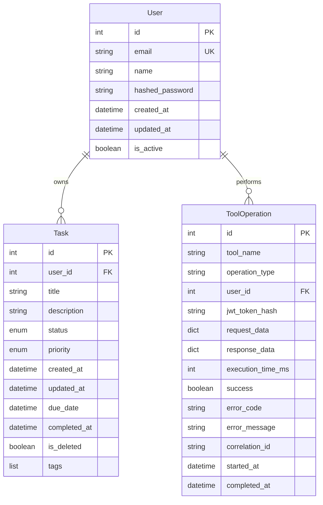
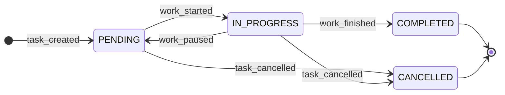

# Data Model: MCP Server Task Management

**Date**: 2025-12-16
**Feature**: Complete MCP Server Implementation and Deployment
**Scope**: Data entities and relationships for MCP task operations

## Overview

The MCP server operates on the same PostgreSQL database and SQLModel entities as the FastAPI backend, ensuring data consistency and eliminating synchronization issues. The data model focuses on task management operations with user isolation and comprehensive audit trails.

## Core Entities

### Task

**Purpose**: Represents a user's TODO item with comprehensive metadata and lifecycle management.

```python
from sqlmodel import SQLModel, Field, Relationship
from datetime import datetime
from enum import Enum

class TaskStatus(str, Enum):
    PENDING = "pending"
    IN_PROGRESS = "in_progress"
    COMPLETED = "completed"
    CANCELLED = "cancelled"

class Priority(str, Enum):
    LOW = "low"
    MEDIUM = "medium"
    HIGH = "high"
    URGENT = "urgent"

class Task(SQLModel, table=True):
    """Core task entity with full lifecycle management."""

    # Primary identification
    id: int = Field(primary_key=True)
    user_id: int = Field(foreign_key="user.id", nullable=False)

    # Core task attributes
    title: str = Field(max_length=255, nullable=False)
    description: str | None = Field(default=None, max_length=2000)

    # Status and priority management
    status: TaskStatus = Field(default=TaskStatus.PENDING)
    priority: Priority = Field(default=Priority.MEDIUM)

    # Temporal tracking
    created_at: datetime = Field(default_factory=datetime.utcnow)
    updated_at: datetime | None = Field(default=None)
    due_date: datetime | None = Field(default=None)
    completed_at: datetime | None = Field(default=None)

    # Metadata
    is_deleted: bool = Field(default=False)  # Soft delete support
    tags: list[str] = Field(default=[])  # JSON field for tag storage

    # Relationships
    user: "User" = Relationship(back_populates="tasks")
```

**Key Validation Rules**:
- `title`: Required, max 255 characters
- `description`: Optional, max 2000 characters
- `status`: Enum with predefined values
- `priority`: Enum with predefined values
- `user_id`: Foreign key, required for user isolation

### User

**Purpose**: System user account with authentication and task ownership.

```python
class User(SQLModel, table=True):
    """User account with authentication capabilities."""

    id: int = Field(primary_key=True)
    email: str = Field(unique=True, max_length=255, nullable=False)
    name: str = Field(max_length=255, nullable=False)

    # Authentication fields
    hashed_password: str = Field(nullable=False)

    # Metadata
    created_at: datetime = Field(default_factory=datetime.utcnow)
    updated_at: datetime | None = Field(default=None)
    is_active: bool = Field(default=True)

    # Relationships
    tasks: list[Task] = Relationship(back_populates="user")
```

### Tool Operation Log

**Purpose**: Audit trail for all MCP tool operations with correlation tracking.

```python
class ToolOperation(SQLModel, table=True):
    """Audit log for MCP tool operations."""

    id: int = Field(primary_key=True)

    # Operation details
    tool_name: str = Field(max_length=100, nullable=False)  # add_task, list_tasks, etc.
    operation_type: str = Field(max_length=50, nullable=False)  # CREATE, READ, UPDATE, DELETE

    # Authentication context
    user_id: int = Field(foreign_key="user.id", nullable=False)
    jwt_token_hash: str = Field(max_length=255)  # Hash for audit purposes

    # Request/response data
    request_data: dict = Field(sa_column=Column(JSON))  # Input parameters
    response_data: dict = Field(sa_column=Column(JSON))  # Tool response
    execution_time_ms: int | None = Field(default=None)

    # Status tracking
    success: bool = Field(nullable=False)
    error_code: str | None = Field(default=None)
    error_message: str | None = Field(default=None)

    # Correlation and timing
    correlation_id: str = Field(max_length=100, nullable=False)
    started_at: datetime = Field(default_factory=datetime.utcnow)
    completed_at: datetime | None = Field(default=None)

    # Relationships
    user: "User" = Relationship()
```

## Entity Relationships

### User-Task Relationship



### Relationship Constraints

1. **User Isolation**: Each task belongs to exactly one user (`user_id` foreign key)
2. **Cascade Behavior**: Deleting a user should soft-delete associated tasks
3. **Audit Trail**: Every MCP tool operation creates a `ToolOperation` record
4. **Data Integrity**: Foreign key constraints enforced at database level

## State Transitions

### Task Status Flow



**Transition Rules**:
- Tasks start as `PENDING`
- Only `PENDING` or `IN_PROGRESS` tasks can be cancelled
- Only `PENDING` or `IN_PROGRESS` tasks can be marked `COMPLETED`
- `COMPLETED` and `CANCELLED` are terminal states
- Soft delete (`is_deleted=true`) can be applied to any state

## Database Schema

### Indexes

**Performance Optimizations**:
```sql
-- User lookup indexes
CREATE INDEX idx_user_email ON user(email);
CREATE INDEX idx_user_active ON user(is_active) WHERE is_active = true;

-- Task filtering indexes
CREATE INDEX idx_task_user_id ON task(user_id);
CREATE INDEX idx_task_status ON task(status) WHERE is_deleted = false;
CREATE INDEX idx_task_priority ON task(priority) WHERE is_deleted = false;
CREATE INDEX idx_task_created_at ON task(created_at) WHERE is_deleted = false;

-- Audit trail indexes
CREATE INDEX idx_operation_user_id ON tool_operation(user_id);
CREATE INDEX idx_operation_tool ON tool_operation(tool_name);
CREATE INDEX idx_operation_correlation ON tool_operation(correlation_id);
CREATE INDEX idx_operation_created_at ON tool_operation(started_at);
```

### Constraints

**Data Integrity**:
```sql
-- Core constraints
ALTER TABLE task ADD CONSTRAINT fk_task_user_id FOREIGN KEY (user_id) REFERENCES user(id) ON DELETE CASCADE;
ALTER TABLE tool_operation ADD CONSTRAINT fk_operation_user_id FOREIGN KEY (user_id) REFERENCES user(id);

-- Business logic constraints
ALTER TABLE task ADD CONSTRAINT chk_task_status_in_list CHECK (status IN ('pending', 'in_progress', 'completed', 'cancelled'));
ALTER TABLE task ADD CONSTRAINT chk_task_priority_in_list CHECK (priority IN ('low', 'medium', 'high', 'urgent'));

-- Temporal constraints
ALTER TABLE task ADD CONSTRAINT chk_task_completed_after_created CHECK (completed_at IS NULL OR completed_at >= created_at);
ALTER TABLE task ADD CONSTRAINT chk_task_due_after_created CHECK (due_date IS NULL OR due_date >= created_at);
```

## JSON Schema Definitions

### Tool Request Schema

```json
{
  "$schema": "http://json-schema.org/draft-07/schema#",
  "type": "object",
  "properties": {
    "tool_name": {
      "type": "string",
      "enum": ["add_task", "list_tasks", "complete_task", "update_task", "delete_task"]
    },
    "parameters": {
      "type": "object",
      "additionalProperties": true
    },
    "user_id": {
      "type": "integer",
      "minimum": 1
    },
    "correlation_id": {
      "type": "string",
      "pattern": "^[a-f0-9-]{36}$"
    }
  },
  "required": ["tool_name", "user_id", "correlation_id"]
}
```

### Task Response Schema

```json
{
  "$schema": "http://json-schema.org/draft-07/schema#",
  "type": "object",
  "properties": {
    "success": {
      "type": "boolean"
    },
    "data": {
      "type": "object",
      "properties": {
        "task": {
          "$ref": "#/definitions/Task"
        },
        "tasks": {
          "type": "array",
          "items": { "$ref": "#/definitions/Task" }
        }
      }
    },
    "message": {
      "type": "string"
    },
    "error": {
      "type": "object",
      "properties": {
        "code": { "type": "string" },
        "message": { "type": "string" }
      }
    },
    "correlation_id": {
      "type": "string"
    }
  },
  "required": ["success", "correlation_id"]
}
```

## Data Access Patterns

### MCP Tool Data Flow

1. **Authentication**: JWT token validation extracts `user_id`
2. **Authorization**: Verify user ownership of target task
3. **Operation**: Execute database operation with transaction
4. **Logging**: Create `ToolOperation` audit record
5. **Response**: Return structured JSON response

### Query Optimization Patterns

**User Task Queries**:
```python
# Optimized task listing with pagination
async def get_user_tasks(user_id: int, status: str = None, limit: int = 20, offset: int = 0):
    async with get_db_session() as session:
        query = select(Task).where(
            Task.user_id == user_id,
            Task.is_deleted == False
        )

        if status and status != "all":
            query = query.where(Task.status == status)

        query = query.offset(offset).limit(limit).order_by(Task.created_at.desc())

        result = await session.exec(query)
        return result.all()
```

**Transaction Patterns**:
```python
# Atomic task creation with validation
async def create_task_with_validation(user_id: int, task_data: dict):
    async with get_db_session() as session:
        try:
            task = Task(user_id=user_id, **task_data)
            session.add(task)
            await session.commit()
            await session.refresh(task)
            return task
        except Exception as e:
            await session.rollback()
            raise
```

## Security Considerations

### User Isolation

- **Database Level**: All queries filtered by `user_id`
- **Application Level**: JWT token validation before data access
- **Audit Trail**: All operations logged with user context

### Data Privacy

- **Soft Delete**: Tasks marked as deleted rather than physically removed
- **Token Hashing**: JWT tokens hashed in audit logs (not stored in clear text)
- **Correlation Tracking**: Unique IDs for request tracing

### Input Validation

- **Type Safety**: SQLModel provides automatic type validation
- **Length Constraints**: Database enforces field length limits
- **Enum Validation**: Status and priority values constrained to valid options

This data model ensures comprehensive task management capabilities while maintaining security, performance, and auditability requirements specified in the functional requirements.