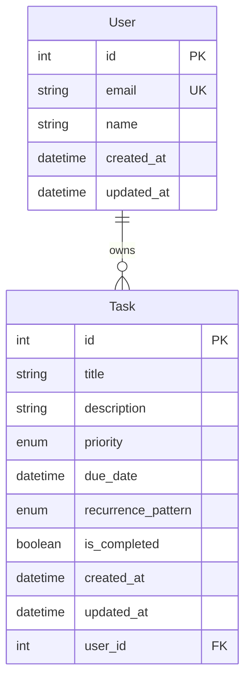
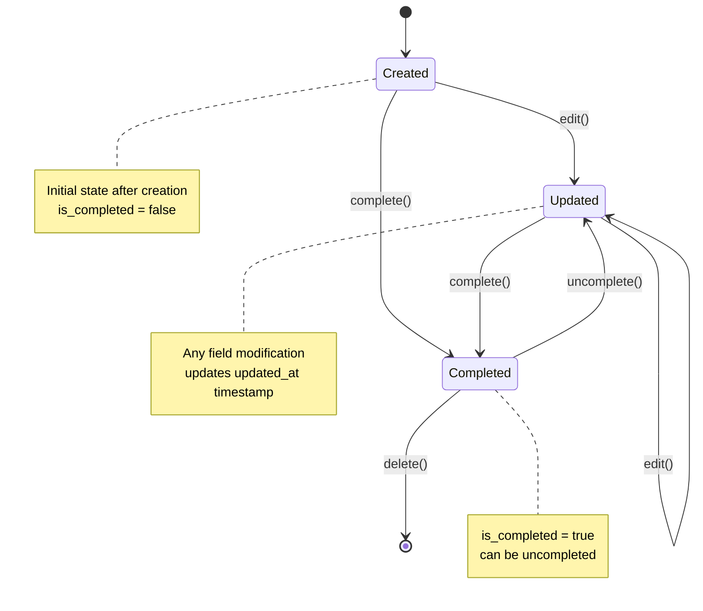

# Data Model: Backend API

**Date**: 2025-12-07
**Feature**: 005-backend-api
**Phase**: Phase 1 - Design & Contracts

## Entity Definitions

### 1. User Entity (Reference from Better Auth)

**Source**: Better Auth managed table
**Table**: `users`
**Purpose**: User authentication and identity management

```python
class User(SQLModel, table=True):
    id: int = Field(primary_key=True)  # Managed by Better Auth
    email: str = Field(unique=True, index=True)  # Managed by Better Auth
    name: str  # Managed by Better Auth
    created_at: datetime  # Managed by Better Auth
    updated_at: datetime  # Managed by Better Auth

    # Relationships
    tasks: List["Task"] = Relationship(back_populates="user")
```

**Key Fields**:
- `id`: Primary key, referenced by all user-specific data
- `email`: Unique identifier for authentication
- `name`: Display name for the user

**Constraints**:
- `email` must be unique across all users
- `id` is immutable (Better Auth managed)
- All fields are managed by Better Auth system

### 2. Task Entity (Core Business Entity)

**Table**: `tasks`
**Purpose**: User task management with full Phase I feature parity

```python
from enum import Enum
from datetime import datetime
from typing import Optional
from sqlmodel import SQLModel, Field, Relationship

class Priority(str, Enum):
    LOW = "low"
    MEDIUM = "medium"
    HIGH = "high"
    URGENT = "urgent"

class RecurrencePattern(str, Enum):
    NONE = "none"
    DAILY = "daily"
    WEEKLY = "weekly"
    MONTHLY = "monthly"
    YEARLY = "yearly"

class TaskBase(SQLModel):
    title: str = Field(..., min_length=1, max_length=200, description="Task title")
    description: Optional[str] = Field(None, max_length=1000, description="Task description")
    priority: Priority = Field(Priority.MEDIUM, description="Task priority level")
    due_date: Optional[datetime] = Field(None, description="Task due date")
    recurrence_pattern: RecurrencePattern = Field(RecurrencePattern.NONE, description="Task recurrence pattern")

class Task(TaskBase, table=True):
    id: Optional[int] = Field(default=None, primary_key=True)
    is_completed: bool = Field(False, description="Task completion status")
    created_at: datetime = Field(default_factory=datetime.utcnow, description="Creation timestamp")
    updated_at: datetime = Field(default_factory=datetime.utcnow, description="Last update timestamp")
    user_id: int = Field(foreign_key="users.id", description="Owner user ID")

    # Relationships
    user: User = Relationship(back_populates="tasks")

    class Config:
        # Ensure proper datetime serialization
        json_encoders = {
            datetime: lambda v: v.isoformat()
        }
```

**Validation Rules**:
- `title`: Required, 1-200 characters, no leading/trailing whitespace
- `description`: Optional, maximum 1000 characters
- `priority`: Enum value, defaults to MEDIUM
- `due_date`: Optional, must be future datetime if provided
- `recurrence_pattern`: Enum value, defaults to NONE
- `user_id`: Foreign key to users table, enforced at database level

**Business Rules**:
- Users can only access their own tasks (enforced by user_id filter)
- Tasks are soft-deleted via is_completed flag
- Due dates with recurrence patterns create future task instances
- Priority levels affect sorting and display ordering

## Entity Relationships

### User ↔ Task Relationship

**Type**: One-to-Many
**Foreign Key**: `tasks.user_id → users.id`
**Cascading**: Delete user cascades to delete all user's tasks



**Relationship Characteristics**:
- Users own multiple tasks (one-to-many)
- Tasks belong to exactly one user (many-to-one)
- User deletion cascades to task deletion (data cleanup)
- Tasks cannot exist without a valid user (referential integrity)

## State Transitions

### Task Lifecycle



**State Descriptions**:

- **Created**: New task with default values
  - `is_completed = false`
  - `created_at = updated_at = current_time`

- **Updated**: Task with modified fields
  - Any field change updates `updated_at`
  - `is_completed` may change
  - Business validation applied

- **Completed**: Task marked as finished
  - `is_completed = true`
  - Can be toggled back to incomplete
  - May trigger recurrence logic

**Transitions**:

1. **Create** → `POST /api/{user_id}/tasks`
2. **Read** → `GET /api/{user_id}/tasks/{id}`
3. **Update** → `PUT /api/{user_id}/tasks/{id}`
4. **Complete** → `PATCH /api/{user_id}/tasks/{id}/complete`
5. **Delete** → `DELETE /api/{user_id}/tasks/{id}`

## Data Integrity Constraints

### Database-Level Constraints

```sql
-- Primary key constraints
ALTER TABLE tasks ADD CONSTRAINT pk_tasks PRIMARY KEY (id);

-- Foreign key constraint with cascade
ALTER TABLE tasks ADD CONSTRAINT fk_tasks_user_id
    FOREIGN KEY (user_id) REFERENCES users(id) ON DELETE CASCADE;

-- Unique constraints (if needed for business rules)
-- ALTER TABLE tasks ADD CONSTRAINT uk_user_title UNIQUE (user_id, title);

-- Check constraints
ALTER TABLE tasks ADD CONSTRAINT ck_title_length
    CHECK (LENGTH(title) BETWEEN 1 AND 200);

ALTER TABLE tasks ADD CONSTRAINT ck_description_length
    CHECK (description IS NULL OR LENGTH(description) <= 1000);

ALTER TABLE tasks ADD CONSTRAINT ck_priority
    CHECK (priority IN ('low', 'medium', 'high', 'urgent'));

ALTER TABLE tasks ADD CONSTRAINT ck_recurrence_pattern
    CHECK (recurrence_pattern IN ('none', 'daily', 'weekly', 'monthly', 'yearly'));

ALTER TABLE tasks ADD CONSTRAINT ck_due_date_future
    CHECK (due_date IS NULL OR due_date >= created_at);
```

### Application-Level Constraints

**User Isolation**:
- All queries must include `WHERE user_id = ?` filter
- JWT token user_id must match URL user_id parameter
- Cross-user data access must return 403 Forbidden

**Business Rules**:
- Title cannot be empty or whitespace-only
- Due dates cannot be in the past (validation error)
- Recurrence patterns require a due date
- Priority levels follow predefined enum values

## Indexing Strategy

### Performance Optimization

```sql
-- Primary index (automatic)
CREATE INDEX pk_tasks ON tasks(id);

-- User filtering (critical for performance)
CREATE INDEX idx_tasks_user_id ON tasks(user_id);

-- Completion status filtering
CREATE INDEX idx_tasks_user_completed ON tasks(user_id, is_completed);

-- Due date sorting and filtering
CREATE INDEX idx_tasks_due_date ON tasks(due_date) WHERE due_date IS NOT NULL;

-- Priority sorting
CREATE INDEX idx_tasks_priority ON tasks(priority);

-- Composite index for common query patterns
CREATE INDEX idx_tasks_user_completed_created ON tasks(user_id, is_completed, created_at);

-- Updated timestamp for sorting task lists
CREATE INDEX idx_tasks_updated_at ON tasks(updated_at);
```

**Index Rationale**:

1. **User Queries**: Most queries filter by `user_id` (100% of operations)
2. **Completion Filtering**: Task lists often filter by completion status
3. **Due Date Operations**: Sorting and filtering by due dates for task management
4. **Priority Sorting**: Task ordering by priority levels
5. **Composite Index**: Optimizes the most common query pattern (user's active tasks)

## Data Access Patterns

### Common Query Patterns

```python
# Get user's active tasks (most common)
SELECT * FROM tasks
WHERE user_id = ? AND is_completed = false
ORDER BY priority DESC, due_date ASC, created_at DESC;

# Get user's completed tasks
SELECT * FROM tasks
WHERE user_id = ? AND is_completed = true
ORDER BY updated_at DESC;

# Get specific task with ownership verification
SELECT * FROM tasks
WHERE id = ? AND user_id = ?;

# Search tasks by title
SELECT * FROM tasks
WHERE user_id = ? AND title ILIKE '%?%'
ORDER BY created_at DESC;

# Get overdue tasks
SELECT * FROM tasks
WHERE user_id = ? AND due_date < NOW() AND is_completed = false
ORDER BY due_date ASC;
```

### Query Optimization Strategies

1. **Pagination**: Use cursor-based pagination for large datasets
2. **Selective Loading**: Only load required fields to reduce payload
3. **Batch Operations**: Use bulk updates for status changes
4. **Connection Pooling**: Optimize database connection reuse
5. **Query Caching**: Cache frequent query results

## Validation Rules Summary

### Input Validation

| Field | Required | Type | Constraints | Validation |
|-------|----------|------|-------------|------------|
| title | Yes | string | 1-200 chars | No leading/trailing whitespace |
| description | No | string | ≤1000 chars | Strip HTML/script tags |
| priority | No | enum | LOW/MEDIUM/HIGH/URGENT | Default: MEDIUM |
| due_date | No | datetime | Future date only | ISO 8601 format |
| recurrence_pattern | No | enum | NONE/DAILY/WEEKLY/MONTHLY/YEARLY | Default: NONE |

### Business Validation

- **User Ownership**: JWT user_id must match task.user_id
- **Due Date Logic**: Cannot set past due dates
- **Recurrence Logic**: Recurrence requires due date
- **Title Uniqueness**: Optional uniqueness per user
- **Completion Logic**: Completed tasks can be uncompleted

## Data Migration Strategy

### Phase II Approach

**Current Phase**: Direct SQLModel schema creation
```python
# In main.py lifespan
async with engine.begin() as conn:
    await conn.run_sync(SQLModel.metadata.create_all)
```

**Future Phase III**: Alembic migrations for production
- Version-controlled schema changes
- Zero-downtime migrations
- Rollback capabilities

### Schema Evolution

**Version 1.0** (Current):
- Basic task fields (title, description, priority, due_date, recurrence)
- User relationship and isolation

**Future Enhancements**:
- Task categories/tags
- Subtasks and dependencies
- File attachments
- Collaboration features
- Advanced scheduling

## Security Considerations

### Data Isolation

- **Row-Level Security**: All queries filtered by user_id
- **JWT Verification**: Token validation on every request
- **Authorization Checks**: URL user_id must match JWT user_id
- **SQL Injection Prevention**: Parameterized queries via ORM

### Privacy Protection

- **User Data Privacy**: No cross-user data exposure
- **Input Sanitization**: HTML/script tag removal
- **Rate Limiting**: Prevent brute force attacks
- **Audit Logging**: Track data modifications

This data model provides a solid foundation for the backend API while maintaining constitutional requirements and supporting all Phase I features.