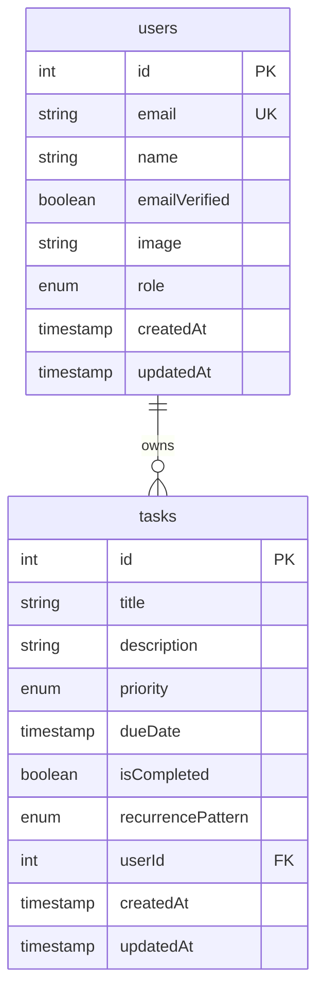
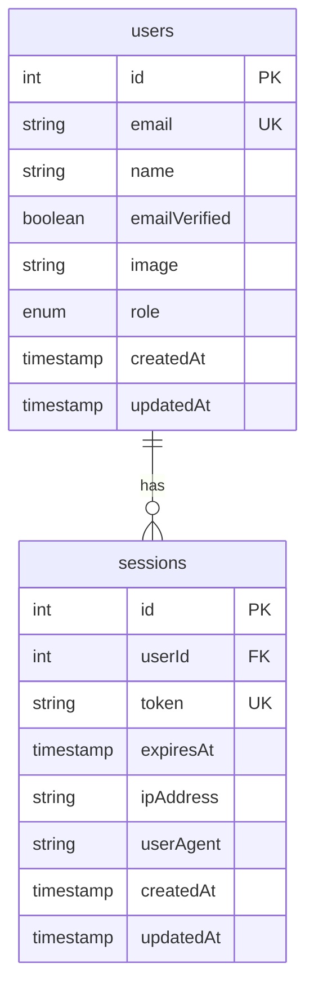

# Data Model: User Authentication

**Feature**: 006-user-auth | **Date**: 2025-12-07

## Entity Definitions

### User Entity (Better Auth Managed)

**Primary Source**: Better Auth library manages the users table
**Database Table**: `users` (created and maintained by Better Auth)

```typescript
interface User {
  id: string                    // Primary key (UUID or integer)
  email: string                 // User email address (unique)
  name: string                  // User display name
  emailVerified: boolean        // Email verification status
  image?: string               // Profile image URL (optional)
  role: 'user' | 'admin'       // User role (default: 'user')
  createdAt: Date              // Account creation timestamp
  updatedAt: Date              // Last update timestamp
}
```

**Database Schema (PostgreSQL)**:
```sql
CREATE TABLE users (
    id SERIAL PRIMARY KEY,
    email VARCHAR(255) UNIQUE NOT NULL,
    name VARCHAR(255) NOT NULL,
    email_verified BOOLEAN DEFAULT FALSE,
    image TEXT,
    role VARCHAR(50) DEFAULT 'user',
    created_at TIMESTAMP DEFAULT CURRENT_TIMESTAMP,
    updated_at TIMESTAMP DEFAULT CURRENT_TIMESTAMP
);

-- Indexes for performance
CREATE INDEX idx_users_email ON users(email);
CREATE INDEX idx_users_role ON users(role);
```

### Session Entity (Better Auth Managed)

**Primary Source**: Better Auth library manages session storage
**Database Table**: `sessions` (created and maintained by Better Auth)

```typescript
interface Session {
  id: string                    // Session identifier
  userId: string                // Foreign key to users.id
  token: string                 // JWT token or session identifier
  expiresAt: Date              // Session expiration time
  ipAddress?: string           // User IP address (optional)
  userAgent?: string           // Browser user agent (optional)
  createdAt: Date              // Session creation timestamp
  updatedAt: Date              // Last activity timestamp
}
```

**Database Schema (PostgreSQL)**:
```sql
CREATE TABLE sessions (
    id SERIAL PRIMARY KEY,
    user_id INTEGER NOT NULL REFERENCES users(id) ON DELETE CASCADE,
    token TEXT NOT NULL UNIQUE,
    expires_at TIMESTAMP NOT NULL,
    ip_address INET,
    user_agent TEXT,
    created_at TIMESTAMP DEFAULT CURRENT_TIMESTAMP,
    updated_at TIMESTAMP DEFAULT CURRENT_TIMESTAMP
);

-- Indexes for performance
CREATE INDEX idx_sessions_user_id ON sessions(user_id);
CREATE INDEX idx_sessions_token ON sessions(token);
CREATE INDEX idx_sessions_expires_at ON sessions(expires_at);
```

### Task Entity (Existing with User Association)

**Primary Source**: Application task management
**Database Table**: `tasks` (existing in backend/src/models/models.py)

```typescript
interface Task {
  id: number                    // Primary key (auto-increment)
  title: string                 // Task title (required)
  description?: string          // Optional task description
  priority: 'low' | 'medium' | 'high' | 'urgent' // Task priority
  dueDate?: Date               // Optional due date
  isCompleted: boolean         // Completion status
  recurrencePattern: 'none' | 'daily' | 'weekly' | 'monthly' | 'yearly'
  userId: number               // Foreign key to users.id
  createdAt: Date              // Task creation timestamp
  updatedAt: Date              // Last update timestamp
}
```

**Database Schema (PostgreSQL)**:
```sql
CREATE TABLE tasks (
    id SERIAL PRIMARY KEY,
    title VARCHAR(200) NOT NULL,
    description TEXT,
    priority VARCHAR(20) DEFAULT 'medium' CHECK (priority IN ('low', 'medium', 'high', 'urgent')),
    due_date TIMESTAMP,
    is_completed BOOLEAN DEFAULT FALSE,
    recurrence_pattern VARCHAR(20) DEFAULT 'none' CHECK (recurrence_pattern IN ('none', 'daily', 'weekly', 'monthly', 'yearly')),
    user_id INTEGER NOT NULL REFERENCES users(id) ON DELETE CASCADE,
    created_at TIMESTAMP DEFAULT CURRENT_TIMESTAMP,
    updated_at TIMESTAMP DEFAULT CURRENT_TIMESTAMP
);

-- Indexes for performance and user isolation
CREATE INDEX idx_tasks_user_id ON tasks(user_id);
CREATE INDEX idx_tasks_completed ON tasks(is_completed);
CREATE INDEX idx_tasks_due_date ON tasks(due_date) WHERE due_date IS NOT NULL;
CREATE INDEX idx_tasks_user_completed ON tasks(user_id, is_completed);
```

## Entity Relationships

### User-Task Relationship (One-to-Many)



**Relationship Rules**:
- One user can have zero or many tasks
- Each task belongs to exactly one user
- Deleting a user cascades to delete all their tasks
- User isolation enforced at database level with foreign key constraints

### User-Session Relationship (One-to-Many)



**Relationship Rules**:
- One user can have multiple active sessions
- Each session belongs to exactly one user
- Deleting a user cascades to delete all their sessions
- Session tokens are unique and have expiration times

## Data Validation Rules

### User Validation

```typescript
const userValidation = {
  email: {
    required: true,
    format: 'email',
    unique: true,
    maxLength: 255
  },
  name: {
    required: true,
    minLength: 1,
    maxLength: 255,
    pattern: /^[a-zA-Z\s'-]+$/
  },
  role: {
    required: true,
    enum: ['user', 'admin'],
    default: 'user'
  },
  emailVerified: {
    required: false,
    default: false,
    type: 'boolean'
  }
}
```

### Task Validation

```typescript
const taskValidation = {
  title: {
    required: true,
    minLength: 1,
    maxLength: 200
  },
  description: {
    required: false,
    maxLength: 1000
  },
  priority: {
    required: false,
    enum: ['low', 'medium', 'high', 'urgent'],
    default: 'medium'
  },
  dueDate: {
    required: false,
    type: 'datetime',
    future: true // Due date must be in the future
  },
  isCompleted: {
    required: false,
    type: 'boolean',
    default: false
  },
  recurrencePattern: {
    required: false,
    enum: ['none', 'daily', 'weekly', 'monthly', 'yearly'],
    default: 'none'
  },
  userId: {
    required: true,
    type: 'integer',
    foreignKey: 'users.id'
  }
}
```

### Session Validation

```typescript
const sessionValidation = {
  userId: {
    required: true,
    type: 'integer',
    foreignKey: 'users.id'
  },
  token: {
    required: true,
    unique: true,
    minLength: 32
  },
  expiresAt: {
    required: true,
    type: 'datetime',
    future: true
  },
  ipAddress: {
    required: false,
    format: 'ipv4' // or 'ipv6'
  },
  userAgent: {
    required: false,
    maxLength: 500
  }
}
```

## Data Access Patterns

### User Data Access (Better Auth Managed)

```typescript
// Better Auth handles user CRUD operations
const authConfig = {
  database: {
    provider: "neon",
    url: process.env.DATABASE_URL
  },
  emailAndPassword: {
    enabled: true,
    requireEmailVerification: false
  }
}
```

### Task Data Access with User Isolation

```typescript
// All task queries must include user isolation
const taskQueries = {
  // Get user's tasks only
  getUserTasks: (userId: number) => `
    SELECT * FROM tasks
    WHERE user_id = ${userId}
    ORDER BY created_at DESC
  `,

  // Create task for specific user
  createTask: (task: CreateTaskDto, userId: number) => `
    INSERT INTO tasks (title, description, priority, due_date, user_id)
    VALUES ($1, $2, $3, $4, ${userId})
  `,

  // Update user's task only
  updateTask: (taskId: number, userId: number, updates: UpdateTaskDto) => `
    UPDATE tasks
    SET title = $1, description = $2, updated_at = CURRENT_TIMESTAMP
    WHERE id = ${taskId} AND user_id = ${userId}
  `,

  // Delete user's task only
  deleteTask: (taskId: number, userId: number) => `
    DELETE FROM tasks
    WHERE id = ${taskId} AND user_id = ${userId}
  `
}
```

## Security Considerations

### Data Protection

1. **User Data**: Sensitive user information (email, name) protected by authentication
2. **Task Data**: User tasks isolated by user_id with database constraints
3. **Session Data**: Temporary tokens with expiration and unique constraints
4. **Audit Trail**: All tables include created_at and updated_at timestamps

### Access Control

1. **User Isolation**: Database enforces user_id foreign key constraints
2. **JWT Verification**: Backend middleware validates user identity
3. **Row-Level Security**: All queries include WHERE user_id = current_user_id
4. **Session Management**: Tokens expire and can be revoked/blacklisted

### Privacy Compliance

1. **Data Minimization**: Only collect necessary user information
2. **Right to Deletion**: User deletion cascades to remove all associated data
3. **Data Encryption**: Sensitive data encrypted in transit (HTTPS)
4. **Session Security**: Secure httpOnly cookies prevent XSS attacks

## Migration Strategy

### Phase 1: Database Schema

```sql
-- Better Auth will create these tables automatically
-- users table managed by Better Auth
-- sessions table managed by Better Auth

-- Ensure tasks table has proper user foreign key
ALTER TABLE tasks
ADD CONSTRAINT fk_tasks_user_id
FOREIGN KEY (user_id) REFERENCES users(id) ON DELETE CASCADE;

-- Add indexes for performance
CREATE INDEX IF NOT EXISTS idx_tasks_user_id ON tasks(user_id);
CREATE INDEX IF NOT EXISTS idx_tasks_user_completed ON tasks(user_id, is_completed);
```

### Phase 2: Data Validation

```typescript
// Add validation schemas to backend
const authSchemas = {
  userCreate: z.object({
    email: z.string().email().max(255),
    name: z.string().min(1).max(255),
    password: z.string().min(8).max(100)
  }),

  userLogin: z.object({
    email: z.string().email(),
    password: z.string().min(1)
  })
}
```

### Phase 3: Access Control Implementation

```python
# Add user isolation to all task operations
@tasks_router.get("/{user_id}/tasks")
async def get_user_tasks(
    user_id: int,
    current_user: User = Depends(get_current_user),
    db: AsyncSession = Depends(get_db)
):
    # Verify user can only access their own data
    if current_user.id != user_id:
        raise HTTPException(status_code=403, detail="Access denied")

    # Query only user's tasks
    tasks = await db.execute(
        select(Task).where(Task.user_id == user_id)
    )
    return tasks.scalars().all()
```

## Performance Considerations

### Database Optimization

1. **Indexing Strategy**:
   - Primary keys indexed automatically
   - Foreign keys indexed for join performance
   - Query-specific indexes for common access patterns

2. **Query Optimization**:
   - User isolation filters use indexed columns
   - Pagination for large task lists
   - Connection pooling for concurrent requests

3. **Caching Strategy**:
   - Session data cached in Redis for performance
   - User data cached for short periods
   - Task queries optimized with proper indexes

### Scaling Considerations

1. **User Growth**: Schema supports unlimited users with proper indexing
2. **Task Volume**: Efficient querying with user isolation prevents data leakage
3. **Session Management**: Automatic cleanup prevents database bloat
4. **Performance Monitoring**: Query execution times tracked and optimized

---

**Related Documents**:
- [Research Findings](research.md) - Technical research and decision rationale
- [API Contracts](contracts/) - OpenAPI specifications and endpoint definitions
- [Quickstart Guide](quickstart.md) - Implementation setup and development instructions