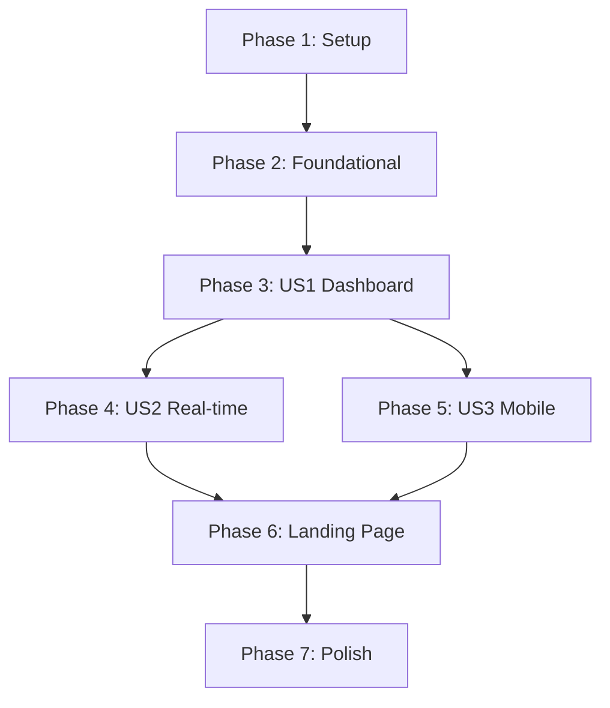

# Implementation Tasks: Frontend Task Management UI

**Feature**: Frontend Task Management UI
**Branch**: `007-frontend-ui`
**Created**: 2025-12-07
**Input**: Specification from [specs/007-frontend-ui/spec.md](spec.md), Plan from [specs/007-frontend-ui/plan.md](plan.md)

## Overview

This document provides a complete, actionable task breakdown for implementing the frontend task management UI. Tasks are organized by user story to enable independent implementation and testing, with clear dependencies and parallel execution opportunities.

## Phase 1: Setup Tasks

### Goal: Initialize project structure and install required dependencies

- [X] T001 Create required directory structure for task management components in `frontend/src/components/tasks/`
- [X] T002 Create lib directory structure for API client and types in `frontend/src/lib/`
- [X] T003 Create protected route group directory in `frontend/src/app/(protected)/`
- [X] T004 Install React Query (TanStack Query) for server state management: `npm install @tanstack/react-query`
- [X] T005 Install React Hook Form and Zod for form validation: `npm install react-hook-form @hookform/resolvers zod`
- [X] T006 Install additional UI libraries: `npm install @tanstack/react-virtual lucide-react date-fns`
- [X] T007 Update frontend/package.json with new dependencies and scripts

## Phase 2: Foundational Tasks

### Goal: Create core infrastructure that blocks all user stories

- [X] T008 Create TypeScript types and interfaces in `frontend/src/lib/types.ts` with complete Task, User, and API types
- [X] T009 Create centralized API client with JWT handling in `frontend/src/lib/api.ts` using the TaskAPI class pattern
- [X] T010 Create React Query hooks for task operations in `frontend/src/hooks/useTasks.ts` with optimistic updates
- [X] T011 Create authentication integration utilities in `frontend/src/lib/auth-client.ts` for Better Auth integration
- [X] T012 Create custom error boundary component in `frontend/src/components/ui/error-boundary.tsx`
- [X] T013 Create loading spinner component in `frontend/src/components/ui/loading-spinner.tsx`
- [X] T014 Create notification system in `frontend/src/components/ui/notification.tsx` for user feedback

## Phase 3: User Story 1 - Task Management Dashboard (P1)

### Goal: Implement core task dashboard with full CRUD functionality

#### Independent Test Criteria: Create test account, sign in, verify dashboard displays tasks with full CRUD working end-to-end

- [ ] T015 [US1] Create TaskItem component in `frontend/src/components/tasks/TaskItem.tsx` with edit, delete, and status change actions
- [ ] T016 [US1] Create TaskList component in `frontend/src/components/tasks/TaskList.tsx` with virtualization for performance
- [ ] T017 [US1] Create TaskForm component in `frontend/src/components/tasks/TaskForm.tsx` with validation and error handling
- [ ] T018 [US1] Create TaskFilters component in `frontend/src/components/tasks/TaskFilters.tsx` with search and filter capabilities
- [ ] T019 [US1] Create dashboard page in `frontend/src/app/(protected)/dashboard/page.tsx` with task list and form integration
- [ ] T020 [US1] Create protected layout in `frontend/src/app/(protected)/layout.tsx` with authentication middleware
- [ ] T021 [US1] Create dashboard sidebar component in `frontend/src/components/layout/sidebar.tsx` with navigation
- [ ] T022 [US1] Create dashboard header component in `frontend/src/components/layout/header.tsx` with user menu
- [ ] T023 [US1] Update root layout to include React Query provider in `frontend/src/app/layout.tsx`
- [ ] T024 [US1] Create empty state component in `frontend/src/components/tasks/empty-state.tsx` for new users
- [ ] T025 [US1] Integrate task form with dashboard page for seamless task creation workflow
- [ ] T026 [US1] Add real-time task updates using React Query cache invalidation
- [ ] T027 [US1] Add confirmation dialog for task deletion in `frontend/src/components/ui/confirm-dialog.tsx`
- [ ] T028 [US1] Add bulk operations for multiple task selection in TaskList component
- [ ] T029 [US1] Add task sorting capabilities by priority, due date, and creation date

## Phase 4: User Story 2 - Real-time Task Updates (P1)

### Goal: Implement instant UI updates without page refresh for all task operations

#### Independent Test Criteria: Perform CRUD operations and verify UI updates instantly without manual refresh

- [ ] T030 [US2] [P] Create WebSocket client hook in `frontend/src/hooks/useWebSocket.ts` for real-time updates
- [ ] T031 [US2] [P] Create real-time task synchronization in `frontend/src/hooks/useRealtimeTasks.ts`
- [ ] T032 [US2] [P] Add optimistic updates to all task mutations in useTasks hook
- [ ] T033 [US2] [P] Create connection status indicator in `frontend/src/components/ui/connection-status.tsx`
- [ ] T034 [US2] [P] Add reconnection logic for WebSocket connections
- [ ] T035 [US2] [P] Integrate real-time updates with TaskList component
- [ ] T036 [US2] [P] Add conflict resolution for concurrent task updates
- [ ] T037 [US2] [P] Add offline detection and queue operations for when connection is lost
- [ ] T038 [US2] [P] Add background sync for queued operations when connection is restored
- [ ] T039 [US2] Add user presence indicators for collaborative task management
- [ ] T040 [US2] Add toast notifications for real-time updates from other users
- [ ] T041 [US2] Add loading states for real-time sync operations

## Phase 5: User Story 3 - Mobile Task Management (P1)

### Goal: Ensure full functionality on mobile devices with responsive design

#### Independent Test Criteria: Access application on mobile (375px viewport) and verify all task management features work

- [ ] T042 [US3] [P] Make TaskItem component fully responsive with touch-friendly actions
- [ ] T043 [US3] [P] Make TaskForm component mobile-responsive with appropriate input sizes
- [ ] T044 [US3] [P] Create mobile navigation component in `frontend/src/components/layout/mobile-nav.tsx`
- [ ] T045 [US3] [P] Add swipe gestures for task actions using react-swipeable in TaskItem
- [ ] T046 [US3] [P] Create mobile-optimized dashboard layout in dashboard page
- [ ] T047 [US3] [P] Add pull-to-refresh functionality for task list
- [ ] T048 [US3] [P] Optimize scrolling performance for mobile devices
- [ ] T049 [US3] [P] Add touch feedback for all interactive elements
- [ ] T050 [US3] [P] Create mobile-optimized modal and dialog components
- [ ] T051 [US3] [P] Add mobile-specific keyboard shortcuts and gestures
- [ ] T052 [US3] [P] Implement progressive web app features in `frontend/public/manifest.json`
- [ ] T053 [US3] Add service worker for offline functionality in `frontend/public/sw.js`
- [ ] T054 [US3] Test and fix all mobile viewport issues from 375px to 1024px
- [ ] T055 [US3] Add mobile-specific error handling and user feedback

## Phase 6: Landing Page Updates

### Goal: Create welcoming landing page with authentication integration

- [ ] T056 Update landing page in `frontend/src/app/page.tsx` with modern design and task management features
- [ ] T057 Add sign-in and sign-up CTAs to landing page
- [ ] T058 Add feature highlights and benefits section
- [ ] T059 Add responsive design for landing page
- [ ] T060 Add loading states for authentication redirects

## Phase 7: Polish & Cross-Cutting Concerns

### Goal: Add finishing touches and optimize performance

- [ ] T061 Add comprehensive error handling with user-friendly messages throughout the application
- [ ] T062 Add input sanitization and XSS protection to all user inputs
- [ ] T063 Add performance monitoring and optimization for large task lists
- [ ] T064 Add accessibility features (ARIA labels, keyboard navigation, screen reader support)
- [ ] T065 Add SEO optimization for landing and public pages
- [ ] T066 Add analytics and error tracking integration
- [ ] T067 Add dark mode support with system preference detection
- [ ] T068 Add internationalization support structure (if required)
- [ ] T069 Add comprehensive browser compatibility testing
- [ ] T070 Add bundle size optimization and code splitting for better performance

## Dependencies and Story Completion Order



### Story Dependencies
- **US1 (Dashboard)**: Must complete before US2 and US3
- **US2 (Real-time)**: Can be done in parallel with US3 after US1
- **US3 (Mobile)**: Can be done in parallel with US2 after US1
- **Landing Page**: Can be done independently after core dashboard functionality

## Parallel Execution Opportunities

### Phase 3 (US1 Dashboard)
```bash
# Parallel tasks for US1 implementation
T015 [US1] Create TaskItem component &
T016 [US1] Create TaskList component &
T017 [US1] Create TaskForm component &
T018 [US1] Create TaskFilters component &
wait
# Integration tasks
T019 [US1] Create dashboard page
```

### Phase 4 (US2 Real-time)
```bash
# All real-time tasks can be done in parallel
T030 [US2] Create WebSocket client hook &
T031 [US2] Create real-time sync hook &
T032 [US2] Add optimistic updates &
T033 [US2] Create connection status indicator &
T034 [US2] Add reconnection logic &
wait
# Integration tasks
T035 [US2] Integrate real-time updates
```

### Phase 5 (US3 Mobile)
```bash
# Mobile responsive tasks can be done in parallel
T042 [US3] Make TaskItem responsive &
T043 [US3] Make TaskForm responsive &
T044 [US3] Create mobile navigation &
T045 [US3] Add swipe gestures &
T046 [US3] Mobile dashboard layout &
wait
# Testing and optimization
T054 [US3] Test mobile viewport issues
```

## Implementation Strategy

### MVP Scope (First Delivery)
- Focus on User Story 1 only (Phase 1-3)
- Basic task CRUD functionality
- Responsive design for desktop and tablet
- Manual testing approach
- Core authentication integration

### Incremental Delivery
1. **Sprint 1**: Phase 1-2 (Setup + Foundational)
2. **Sprint 2**: Phase 3 (User Story 1 - Dashboard)
3. **Sprint 3**: Phase 4 (User Story 2 - Real-time)
4. **Sprint 4**: Phase 5 (User Story 3 - Mobile)
5. **Sprint 5**: Phase 6-7 (Polish & Landing Page)

### Risk Mitigation
- **Performance**: Implement virtualization early in Phase 3
- **Authentication**: Test Better Auth integration in Phase 2
- **Mobile**: Design mobile-first from the beginning
- **Real-time**: Use React Query optimistic updates as fallback

## Task Summary

- **Total Tasks**: 70
- **Phase 1 (Setup)**: 7 tasks
- **Phase 2 (Foundational)**: 7 tasks
- **Phase 3 (US1 Dashboard)**: 15 tasks
- **Phase 4 (US2 Real-time)**: 12 tasks
- **Phase 5 (US3 Mobile)**: 14 tasks
- **Phase 6 (Landing Page)**: 5 tasks
- **Phase 7 (Polish)**: 10 tasks

### Parallel Opportunities
- **Phase 3**: 4 parallel component creation tasks
- **Phase 4**: 5 parallel real-time feature tasks
- **Phase 5**: 5 parallel mobile optimization tasks

Each user story provides independent, testable functionality that can be delivered incrementally while maintaining the overall project architecture and quality standards.